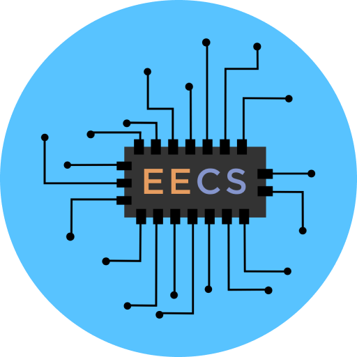

<p align="center">
  
</p>

# Lowell EECS Club 💻
The official website of Lowell EECS Club.

[](https://app.netlify.com/sites/lowelleecs/deploys)

## Installation
To develop on this repository, simply clone:
```sh
cd ~
git clone https://github.com/eecs-club/website.git
```
...then install the npm package.
```sh
cd website
npm install
```
## Starting a development server
To start a hot-reloading local server for development, just use the `develop` script.
```sh
npm run develop
# ...
# Server should run at https://localhost:8000
```
